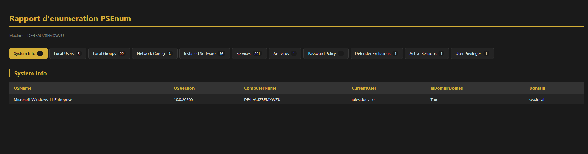

# PSEnum

Module PowerShell d'**énumération locale Windows**, structuré en architecture modulaire.

## Contexte

L'énumération est la phase de reconnaissance d'une attaque : avant toute exploitation, un attaquant qui a obtenu un premier accès cherche à cartographier la machine — qui est connecté, quels privilèges sont disponibles, quel antivirus tourne, quelles exclusions existent, quels logiciels sont installés et potentiellement vulnérables.

PSEnum reproduit cette phase, mais dans une **optique défensive**. L'objectif est de comprendre ce qu'un attaquant collecte, pour mieux le détecter côté SOC :

- **Savoir ce qui est visible** — un compte non privilégié voit déjà énormément de choses. Mesurer cette surface, c'est mesurer ce qu'un attaquant obtient gratuitement.
- **Identifier les angles morts** — les exclusions Defender sont exactement ce qu'un attaquant cherche en premier pour y déposer sa charge utile. Les connaître, c'est pouvoir les auditer.
- **Reconnaître les signaux** — les commandes utilisées ici (`net accounts`, `whoami /priv`, requêtes WMI, lecture du registre Uninstall) sont celles qu'on retrouve dans les logs après une compromission. Les avoir écrites soi-même aide à les repérer en triage d'alertes.

Toutes les fonctions sont en **lecture seule** : aucune modification n'est apportée au système.

---

## Prérequis

- Windows 10 / 11 ou Windows Server
- PowerShell 5.1 ou supérieur
- Microsoft Edge ou Google Chrome — uniquement pour l'export PDF

---

## Installation

```powershell
git clone https://github.com/Jules55-cyber/Project-script-Powershell.git
cd Project-script-Powershell
Import-Module .\PSEnum.psm1 -Force
```

Vérifier que le module est bien chargé :

```powershell
Get-Command -Module PSEnum
```

> Après chaque modification du code, recharger avec `-Force`. C'est la cause n°1 des erreurs « commande non reconnue ».

---

## Utilisation

Point d'entrée principal :

```powershell
Invoke-EnumFull -Format HTML
```

---

## Fonctions publiques

| Fonction | Ce qu'elle collecte | Admin requis |
|---|---|---|
| `Get-EnumSystemInfo` | OS, version, nom de machine, utilisateur courant, domaine | Non |
| `Get-EnumLocalUsers` | Comptes locaux, état activé/désactivé, dernière connexion | Non |
| `Get-EnumLocalGroups` | Groupes locaux et leurs descriptions | Non |
| `Get-EnumNetworkConfig` | IP, masque, MAC, passerelle, serveurs DNS | Non |
| `Get-EnumInstalledSoftware` | Logiciels installés (registre Uninstall 32 et 64 bits) | Non |
| `Get-EnumServices` | Services Windows et leur état | Non |
| `Get-EnumAntivirus` | Antivirus enregistrés auprès du Security Center | Non |
| `Get-EnumActiveSessions` | Sessions ouvertes, état, temps d'inactivité | Non |
| `Get-EnumPrivilegesUsers` | Groupes d'appartenance, SID, privilèges de l'utilisateur | Non |
| `Get-EnumPasswordPolicy` | Politique de mots de passe locale | **Oui** |
| `Get-EnumDefenderExclusions` | Exclusions Defender (chemins, extensions, processus) | **Oui** |
| `Invoke-EnumFull` | Orchestrateur — lance tout et génère le rapport | Recommandé |

Chaque fonction peut être appelée seule et renvoie des objets `[PSCustomObject]` exploitables dans un pipeline :

```powershell
Get-EnumServices | Where-Object { $_.Status -eq 'Running' }
```

---

## Le rôle d'`Invoke-EnumFull`

`Invoke-EnumFull` est l'orchestrateur du module. En une commande, il enchaîne :

1. **Vérification des privilèges** — avertit si la session n'est pas administrateur
2. **Collecte** — appelle successivement toutes les fonctions `Get-Enum*` et empile les résultats
3. **Journalisation** — trace chaque étape avec horodatage (INFO / WARN / ERROR)
4. **Export** — génère le fichier au format demandé dans `.\output\`
5. **Affichage** — présente les résultats groupés par catégorie dans la console

C'est la commande à utiliser au quotidien. Les fonctions individuelles servent surtout au débogage ou à une collecte ciblée.

---

## Formats d'export

Tous les rapports atterrissent dans **`.\output\`** (créé automatiquement s'il n'existe pas), nommés `rapport_AAAAMMJJ_HHMMSS.<extension>`.

### JSON — pour l'intégration

```powershell
Invoke-EnumFull -Format JSON
```
Format structuré, idéal pour ingestion dans un SIEM ou traitement automatisé.

### CSV — pour l'analyse tabulaire

```powershell
Invoke-EnumFull -Format CSV
```
Ouvrable dans Excel, pratique pour trier et filtrer.

### HTML — pour la lecture

```powershell
Invoke-EnumFull -Format HTML
```
Rapport interactif avec **navigation par onglets** : un onglet par catégorie, compteur d'éléments, thème sombre. Les champs imbriqués (groupes, privilèges) sont dans des blocs repliables.

### PDF — pour l'archivage et la transmission

```powershell
Invoke-EnumFull -Format PDF
```
Génère le HTML puis le convertit via Edge ou Chrome en mode headless. À l'impression, **toutes les catégories sont dépliées**, une par page — le PDF contient donc l'intégralité du rapport, pas seulement l'onglet actif.

Le fichier HTML est conservé à côté du PDF.

---

## Aperçu du rapport HTML



---

## Droits administrateur

Le module fonctionne **sans élévation**, mais deux fonctions renvoient des résultats incomplets ou vides sans privilèges administrateur :

- `Get-EnumPasswordPolicy`
- `Get-EnumDefenderExclusions`

`Invoke-EnumFull` détecte le contexte et affiche un avertissement le cas échéant :

```
[WARN] Session non administrateur : résultats possiblement incomplets.
```

Pour une collecte complète, lancer PowerShell ou VS Code **en tant qu'administrateur**.

C'est en soi une information utile : la différence entre les deux exécutions montre concrètement ce qu'un attaquant gagne en obtenant une élévation de privilèges.

---

## Structure du projet

```
Project-script-Powershell/
├── src/
│   ├── Public/          # 1 fichier = 1 fonction exportée
│   │   ├── Get-EnumSystemInfo.ps1
│   │   ├── Get-EnumLocalUsers.ps1
│   │   ├── Get-EnumLocalGroups.ps1
│   │   ├── Get-EnumNetworkConfig.ps1
│   │   ├── Get-EnumInstalledSoftware.ps1
│   │   ├── Get-EnumServices.ps1
│   │   ├── Get-EnumAntivirus.ps1
│   │   ├── Get-EnumActiveSessions.ps1
│   │   ├── Get-EnumPrivilegesUsers.ps1
│   │   ├── Get-EnumPasswordPolicy.ps1
│   │   ├── Get-EnumDefenderExclusions.ps1
│   │   └── Invoke-EnumFull.ps1
│   └── Private/         # helpers internes, non exportés
│       ├── Test-IsAdmin.ps1
│       ├── Write-EnumLog.ps1
│       ├── Export-EnumReport.ps1
│       └── Show-EnumReport.ps1
├── tests/               # tests Pester
├── output/              # rapports générés (ignoré par Git)
├── PSEnum.psm1          # chargeur du module
└── README.md
```

### Public et Private

La séparation est volontaire et structure tout le module :

- **`src/Public/`** — ce que l'utilisateur tape. Ces fonctions sont exportées par `Export-ModuleMember` et apparaissent dans `Get-Command -Module PSEnum`.
- **`src/Private/`** — la plomberie interne. Ces fonctions ne sont **pas** exportées : elles ne sont appelables que depuis l'intérieur du module. C'est ce qui permet de modifier l'implémentation de l'export ou du log sans casser l'interface publique.

Le fichier `PSEnum.psm1` charge dynamiquement les deux dossiers par dot-sourcing, puis n'exporte que le contenu de `Public/`.

Toutes les fonctions publiques renvoient des `[PSCustomObject]` avec un champ `Category` — c'est ce champ qui sert au regroupement dans l'affichage console et à la génération des onglets dans le rapport HTML.

---

